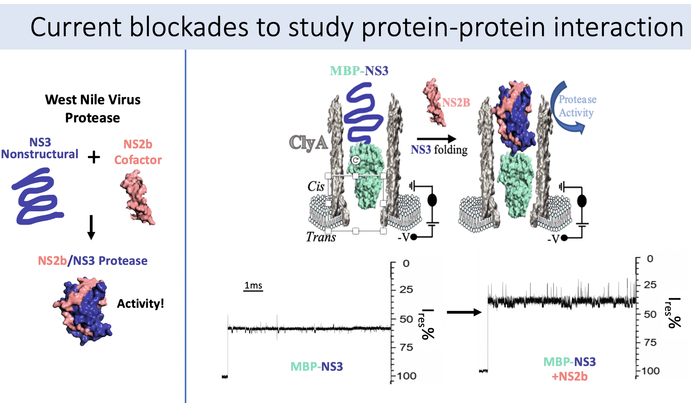

I am currently working on the ClyA-AS nanopore to study the NS2b/NS3 West Nile Virus Protease. I am interested in studying the protein-protein interaction of NS2b and NS3 and the associated conformational change of NS3 as it goes from nonstructural to structured, after association with NS2b, its cofactor.

